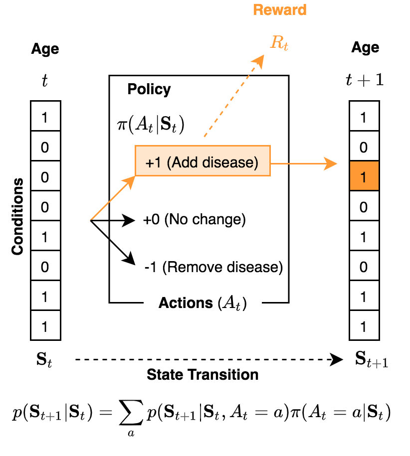

# HDRUK-Turing Reinforcement Learning Project

## Project Overview

Reinforcement Learning (RL) is a dynamic learning paradigm in which an "agent" interacts with the environment by performing "actions" according to a "policy". The policy is optimised (learning) in order to maximise the expected reward received from the environment. As a consequence, reinforcement learning can cater to certain complexities, often involving time-varying components, in health problems that cannot be formulated using static modelling approaches (e.g. classification tasks). Recently, the developments in "deep reinforcement learning" have been transformational by leveraging the utility of deep neural networks to overcome limiting parametric assumptions and provide efficient optimisation based frameworks for learning.

The aim of this project is to provide a focused period to learn about RL to arm yourself with a new skill that might be beneficial for your future research. We will do this by developing a trajectory model for multimorbidity by constructing a multi-state model, with a large state space, through a reinforcement learning approach. 

Multimorbidity refers to the conditions of individuals having multiple disease conditions at the same time. A major research question is to understand the sequences that conditions are acquired in and whether there are distinct patterns underlying those disease patterns. In order to do this we require a time-varying model of disease acquisition. However, as there are 100s of conditions, and patient databases can contain millions of individuals with 10s of millions of electronic records, the potential models could be vast.

Aims:

1. To develop an understanding of reinforcement learning and the various learning paradigms (e.g. policy gradient, actor-critic, Q-learning) and the deep RL extensions.

2. To understand the problem of multimorbidity trajectory modelling and the utility of multi-state models.

3. To develop and implement a RL-based approach for learning multi-state models.

If time allows, application to real world datasets will be undertaken but this is principally a methodological learning and development project. You will therefore be guided to develop skills in generating suitable artificial but real-world inspired data sets for model development.

## Project Tasks

### Underpinning statistical modelling

There are two important statistical frameworks to be understood in this project: *Multi-state regression models* (MSM) and *Markov decision processes* (MDP).

An understanding of MDPs is vital for the study of reinforcement learning while MSMs are a useful statistical framework for multimorbidity. 

Following your reading:

1. Create and implement a simple simulation of a Markov decision process. Use this simulator to produce synthetic datasets for later use.
2. [Optional] Implement a statistical inference algorithm for a multi-state regression model. You may test this using the synthetic data in Step 1.

### Basic RL algorithms

There are a range of classic RL approaches and it can be challenging to categorise the different variants. A useful differentiator is those techniques that yield *deterministic* or *stochastic* policies which lead to value-based or policy gradient techniques.  

Q-learning is one of the most common RL approaches to solve MDP problems which leads to deterministic policies. After reading, conduct the following:

1. Implement a Q-learning algorithm to estimate the optimal policy. 
2. Apply to the synthetic dataset you produced previously. Did you recover the policy you used?

In order to understand Q-learning, you will need to focus on the concepts of exploration and exploitation.

Policy gradient approaches give rise to stochastic policies (distributions over actions). These are naturally quite attractive but have some difficulties which have led to the development of so-called *actor-critic* methods.

1. Implement a policy gradient algorithm to estimate an optimal stochastic policy. 
2. Apply to the synthetic dataset you produced previously. Did you recover the policy you used?
3. Can you extend the technique to use an actor-critic approach?

### Going beyond and in parallel

Once you have developed (or in parallel) a strong understanding of these fundamental RL concepts, we will turn our attention to reformulating the multimorbidity problem in a form which is amenable to RL. However, there is no pressure for you to reach this stage during this project, the most vital thing is that you acquire a deep understanding of the theoretical concepts and the detailed implementation knowledge to code these methods up.

## Milestones

Date    | Deliverable |
--------|-------------|
14 March | Simulations of Markov decision processes |
30 March | "What is Q-learning?" blog |
30 April | "What is actor-critic based learning?" blog |

## 
